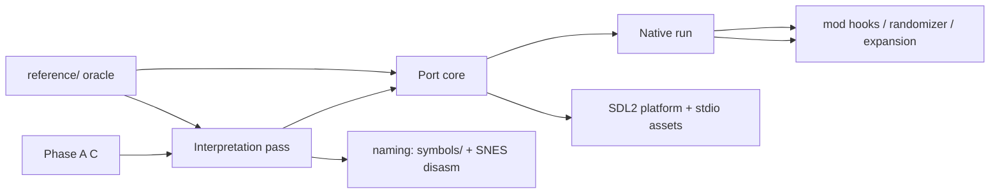

# Phase B — source-port plan (draft, frozen shape only)

Entry gate: Phase A closed — 2516/2516 C-written, each either byte-verified or
runtime-verified against the reference oracle; `decomp/STATUS.md` green.

## 0. Interpretation pass
- Rename `func_8012XXXX` → semantic names (fn in SYMBOLS + everything8215/ff4).
- **PS1-only subsystems have NO SNES counterpart** — everything8215/ff4 can't
  name them; name manually from PS1 context:
  - memory-card save/load code, memo/save-menu state,
  - FMV driver/skip path, bestiary data+UI,
  - the PSY-Q runtime-hook layer (BREAK/syscall/vector poles, 8018F0xx-80198xxx).
- Merge per-function C into domains: battle, menu, config, event, anim, save.
- Kill dead emulation weight: `INCLUDE_ASM` macros, lane artifacts, delay-slot
  comments, register-latch doc comments become real control flow.
- Data classes: promote `$gp`-rel globals to typed structs/arrays (D_8019ED40..).

## 1. Port core
- Device layer: implement reference `gpu.c`/`spu.c`/`cdrom.c` *semantics* on
  SDL2 + stdio. CD-ROM becomes asset-table lookup (was embedded-disc blob).
- Boot: main() → init device layer → run game main; BIOS HLE gone.
- Save data: file-based (memcard semantics), exposed for modding.

## 2. Native run (first milestone)
- Game boots to title on Linux x86-64 with SDL2 window + controller.
- Comparison gate: same-route oracle playthrough (screenshots heuristics) —
  parity check against reference build.

## 3. Expansion (Phase C)
- Renderer seam first (native window + upscale); widescreen/expansion is a later track (Phase C), not a port goal.
- Mod hooks: event/status patches (SoH-style), randomizer seed framework.
- Portability: plain C + SDL2 → DC-class targets by construction.

## Conventions
- `port/src/` per-domain; `port/platform/` for device-layer backends;
  `port/assets/` extracted+manifested; `port/tests/` parity scripts.
- Keep `src/` untouched after Phase A close (port is a derived work; comments
  point back at `src/` function IDs until renaming is complete).
